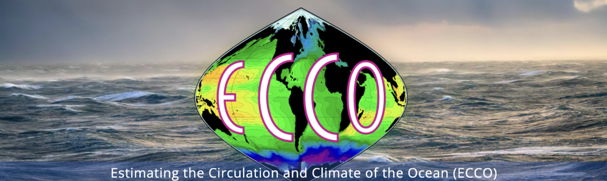
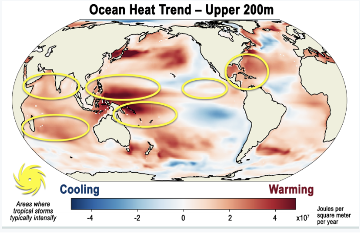
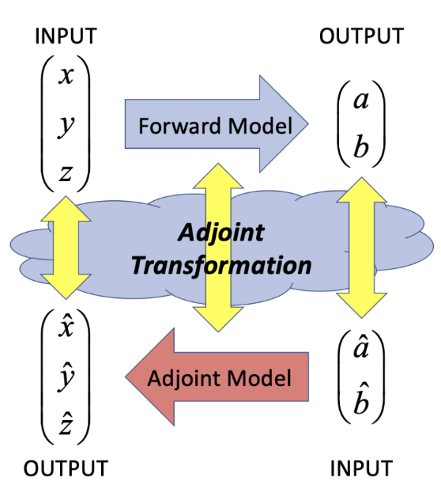
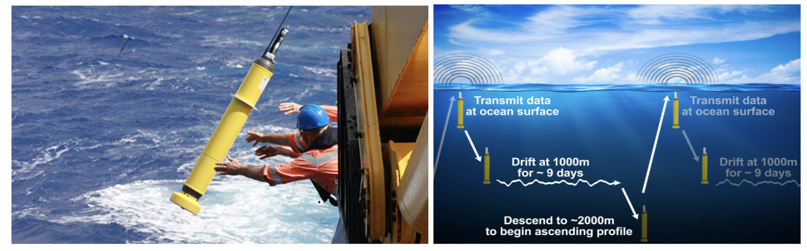
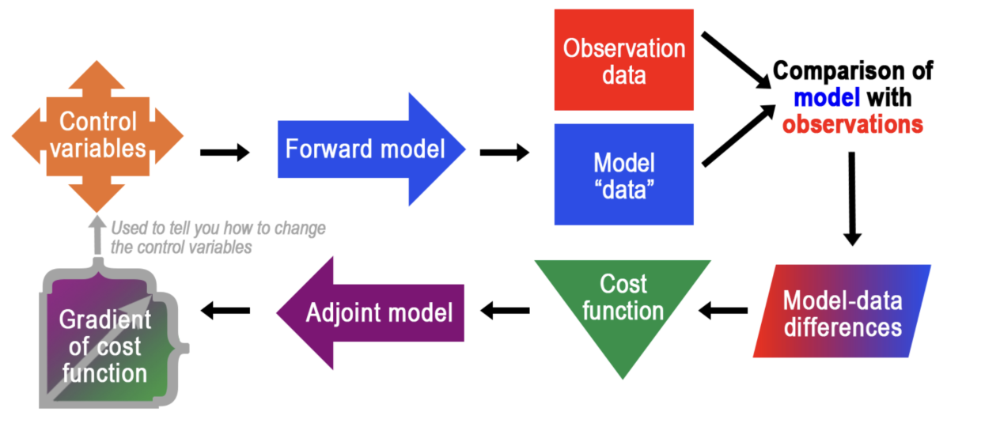

# ECCO (Estimating the Circulation and Climate of the Ocean) Model

Understanding ocean circulation and its influence on climate systems is critical, particularly in the face of a changing climate. Temperature and salinity are the primary drivers of global ocean currents, regulating the distribution of heat and nutrients throughout the oceans. These processes are essential not only for sustaining marine ecosystems—from microscopic plankton to the largest marine mammals—but also for shaping global weather patterns.

In a warming climate, the heat stored in the ocean’s layers becomes increasingly significant. This heat transport directly impacts polar regions, influencing the melting rates of marine-terminating glaciers and icebergs, the extent and longevity of sea ice, and the habitat suitability for polar species. These changes, in turn, have profound implications for indigenous communities, whose traditions and livelihoods are intricately tied to stable polar environments.

The cascading effects of changing ocean conditions are far-reaching, contributing to sea-level rise and affecting key systems such as the Atlantic Meridional Overturning Circulation (AMOC), which regulates the global climate. Furthermore, rising ocean temperatures have intensified the frequency and severity of tropical storms and hurricanes. Areas of warming, illustrated by red regions in Figure 1, highlight zones where ocean temperatures have risen significantly in recent decades. These regions often coincide with the paths of destructive hurricanes and cyclones, fueled by warm ocean waters.

## Model Description:

ECCO is a state-of-the-art global ocean data assimilation model designed to estimate the time-evolving state of the ocean. It combines a numerical ocean circulation model (MIT-gcm) with observational data through adjoint-based optimization (refer to Fig. 2). This approach minimizes the mismatch between the model output and observations while ensuring that physical laws like conservation of mass and momentum are respected.

MITgcm is a numerical model designed for the study of the atmosphere, ocean, and climate with a flexible non-hydrostatic formulation that enables it to efficiently simulate fluid phenomena over a wide range of scales.

The model uses the MITgcm (MIT General Circulation Model) as its core, which solves the primitive equations governing ocean and sea-ice dynamics. Key processes represented in ECCO include:

- **Advection and diffusion of tracers** (e.g., temperature, salinity)
- **Ocean-ice-atmosphere interactions**
- **Tidal forcing and its impact on circulation**

### Main Outputs:

#### Ocean + Sea-Ice:
- Ocean temperature, salinity, and velocity
- Sea-ice and snow
- Lateral and vertical fluxes of volume, heat, salt, and momentum

#### Atmosphere:
- Radiative fluxes
- Air-sea-ice-ocean fluxes of heat, moisture, energy, and momentum

## Data Needs:
ECCO relies on a diverse set of observational datasets:

### Satellite Data:
- Altimetry (e.g., TOPEX/Poseidon)
- Sea surface temperature (e.g., MODIS)
- Sea surface salinity

### In Situ Data:
- Argo floats
- Moorings
- Ship-based measurements

### Atmospheric Forcing:
- Wind stress
- Precipitation
- Heat fluxes from reanalysis products (e.g., ERA5)

### Observational Data Used to Constrain the Model:

| Observation Type            | Dataset/Source                                                                 |
|-----------------------------|------------------------------------------------------------------------------|
| Sea surface height          | ERS-1/2, TOPEX/Poseidon, Jason series, CryoSat-2, etc.                       |
| Global mean sea level       | AVISO, CSIRO, NOAA, U.Colorado                                               |
| In situ temperature         | Argo floats, CTDs, XBTs, marine mammals, etc.                               |
| In situ salinity            | CTDs, moorings, Argo floats, etc.                                           |
| Sea surface temperature     | AVHRR                                                                       |
| Sea surface salinity        | Aquarius                                                                    |
| Sea-ice concentration       | SSM/I, SSMIS                                                                |
| Ocean bottom pressure       | GRACE                                                                       |
| T and S climatology         | World Ocean Atlas 2009                                                      |
| Mean dynamic topography     | DTU17MDT                                                                    |

![Instrumented Seal(pictures/seal-instrumentation.png)

## Calibration:

### Physical Parameters:

1. **Vertical Mixing Coefficients:**
   - Governs the vertical exchange of tracers (e.g., heat, salt) and momentum.
   - **Calibration Need:** Adjust to match observed temperature and salinity profiles.
   - **Target Observations:** Argo floats, CTD profiles.

2. **Horizontal Diffusion Coefficients:**
   - Represents lateral mixing of tracers.
   - **Calibration Need:** Ensure tracer transport reflects observed currents and mixing.
   - **Target Observations:** Drifter data and satellite-derived tracer distributions.

3. **Surface Boundary Conditions:**
   - Includes wind stress, heat fluxes, and freshwater fluxes.
   - **Calibration Need:** Correct biases in ocean-atmosphere interactions.
   - **Target Observations:** Satellite-derived wind fields and reanalysis heat flux data.

### Dynamical Parameters:

1. **Sea Surface Height (SSH) Gradients:**
   - Related to geostrophic flow.
   - **Calibration Need:** Match simulated SSH anomalies to satellite altimetry data.
   - **Target Observations:** Altimeter datasets.

2. **Tidal Forcing Amplitudes:**
   - Influence regional dynamics near coasts and shallow seas.
   - **Calibration Need:** Ensure accuracy in tidal mixing and residual flows.
   - **Target Observations:** Tide gauge measurements.

### Numerical Parameters:

1. **Time Step and Grid Resolution:**
   - Affect the stability and accuracy of simulations.
   - **Calibration Need:** Ensure CFL condition is met without excessive computational cost.

2. **Advection and Diffusion Schemes:**
   - Solves tracer transport equations.
   - **Calibration Need:** Prevent artificial diffusion or numerical oscillations.

## Numerical Experiment Design:

### Initial Conditions:
- **Temperature and Salinity:**
  - Start with observed global distributions (e.g., World Ocean Atlas).

- **Sea Surface Height (SSH):**
  - Use satellite altimetry observations.

- **Currents:**
  - Initialize using velocity fields from ECCO reanalysis.

### Boundary Conditions:

#### Surface:
- Wind Forcing: Wind stress from atmospheric reanalysis (e.g., ERA5).
- Heat Fluxes: Solar radiation, latent, and sensible heat fluxes.
- Precipitation/Evaporation: Surface freshwater fluxes from rain, evaporation, and rivers.

#### Lateral (Edges):
- Conditions for temperature, salinity, currents, and tracers from global ocean models.

#### Bottom:
- Interactions using bathymetry data (e.g., GEBCO or ETOPO1).

### Key Concepts:
- **Forward Model:** Simulates changing conditions (e.g., ocean currents moving heat).
- **Data Differences:** Calculates the "misfit" between forward model output and observations.
- **Cost Function:** Measures how well model output matches observations.
- **Adjoint Model:** Adjusts control variables to reduce model-data differences.
- **Cost Function Gradient:** Provides directional information for iterative optimization.
